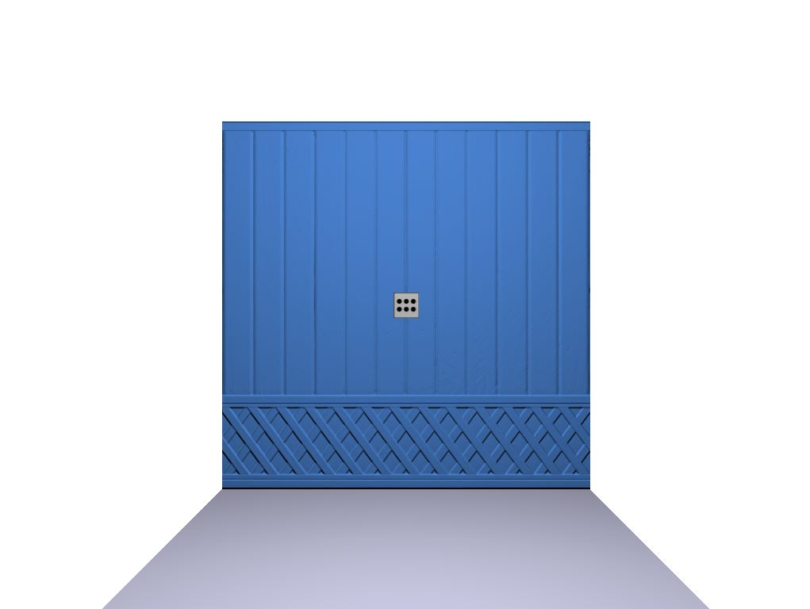
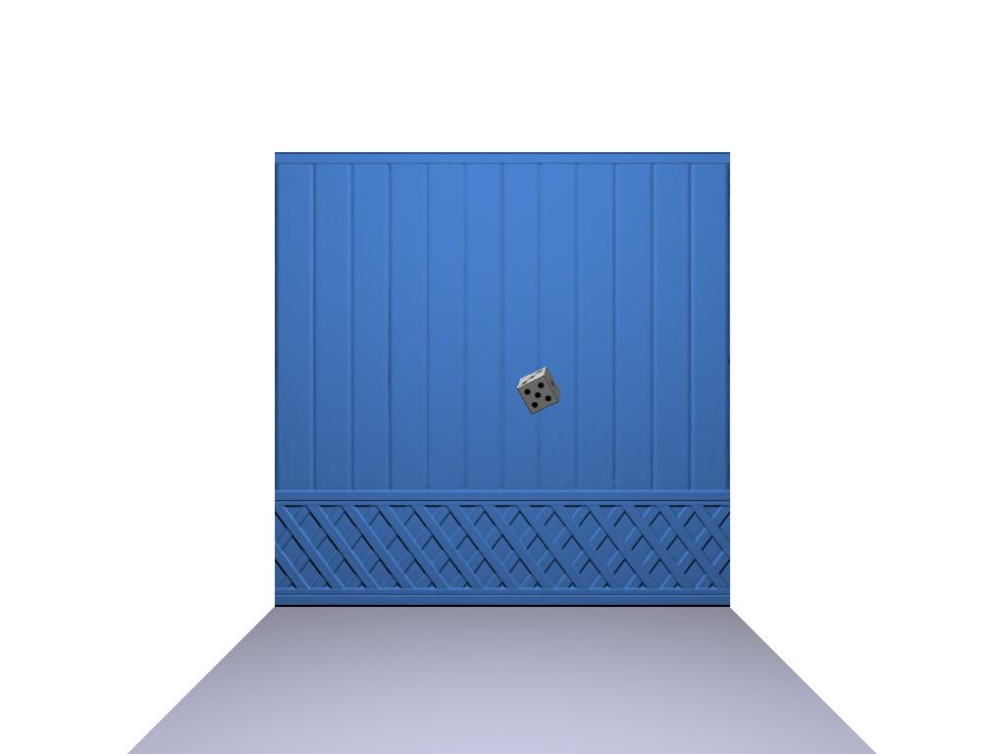

# Rigid Body Exercise



This project is an exercise in simulating rigid body dynamics. It includes a central dice that can be affected by forces when the user presses `P`. The simulation considers translation and rotation using quaternions. Additionally, there are textures applied to both the dice and the wall.

## Features

- Simulates rigid body dynamics with translation and rotation.
- User can apply a force to the dice by pressing `P`.
- Implements quaternion rotations for accurate spatial orientation.
- Textures applied to both the dice and the wall.

## How to Build and Run

### Requirements
- CMake
- C++ Compiler

1. **Build the Project**
   - Open a terminal or command prompt.
   - Navigate to the project's root directory.
   - Use the following commands to build the project:

   ```bash
   mkdir build
   cd build
   cmake ..
   make
This will generate the executable.

2. Run the Program

    After building the project, use the following command to execute the program:

bash

./tpRigid

Controls

    P: Apply force to the dice.
    R: Reset the animation.
    Mouse: Moves camera


Future Improvements

    Makes the force and the position of the dice editable for the user
